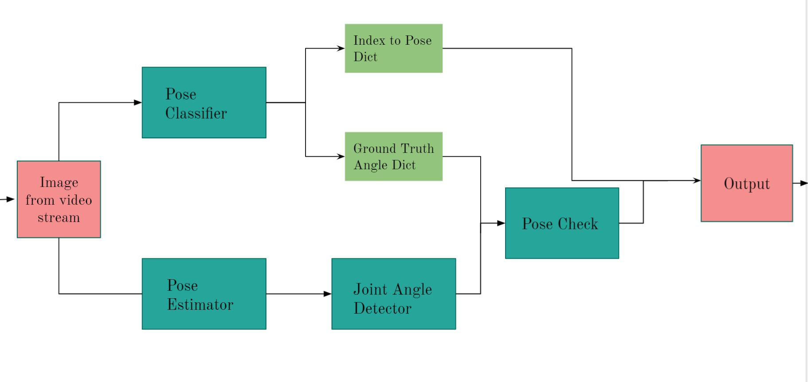

# YOGA COACH - A human pose estimation application
We present a yoga coach which helps an individual correct their posture using modern deep learning techniques.
Given a video/image our coach helps figure out whether a person is doing the classified pose correctly basedon the similarity of angles between ground truth and
the image.

## Built with 

* [PyTorch](https://pytorch.org/)
* [MediaPipe](https://google.github.io/mediapipe/solutions/pose.html)
* [Flask](https://flask.palletsprojects.com/en/2.0.x/)

### Pipeline for yoga-coach

<br />
<p align="center">
  <a href="https://github.com/divyanshjoshi/Yoga-coach">
    
  </a>
</p>

### Getting Started
1. Fork and Clone the repo
   ```sh
   git clone https://github.com/your_username_/Yoga-coach-.git
   ```
2. Install all the prequisties using the requirements.txt file 
   ```sh
   pip install -r requirements.txt
   ```
3.  Run app.py in terminal
     ```sh
     python app.py
     ```
 
### Results
<br />
<p align="center">
  <a href="https://github.com/divyanshjoshi/Yoga-coach">
    
  </a>
</p>

### Refrences
#### [Yoga_82 Dataset](https://arxiv.org/abs/2004.10362)
#### [Kaggle Dataset](https://www.kaggle.com/niharika41298/yoga-poses-dataset)
#### [Blaze Pose](https://arxiv.org/pdf/2006.10204.pdf)
